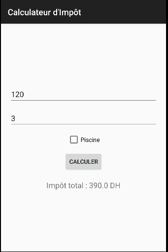
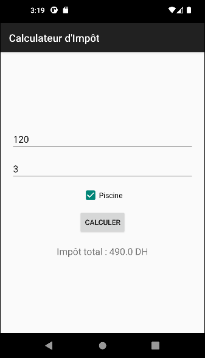

# Calculateur d'Impôts Locaux - Android Lab Report

## 📱 App Screenshots

## 🛠 Technologies Used
- **Language:** Java
- **Framework:** Android SDK
- **Minimum API:** 24 (Android 7.0 Nougat)
- **UI Layout:** LinearLayout with XML
- **Components:** EditText, CheckBox, Button, TextView
- **IDE:** Android Studio
- **Event Handling:** OnClickListener with lambdas
- **Input Validation:** Try-catch for NumberFormatException

## 💡 Project Idea
Create a local tax calculator app demonstrating:
- UI design in XML with multiple input types
- User input handling (text → numbers)
- Conditional logic (CheckBox state)
- Business logic implementation
- Error handling for invalid inputs
- Dynamic result display

## 🏗 Project Structure
CalculateurImpot/
├── app/
│ ├── src/main/
│ │ ├── java/com/example/calculateurimpot/
│ │ │ └── MainActivity.java
│ │ ├── res/
│ │ │ ├── layout/
│ │ │ │ └── activity_main.xml
│ │ │ └── values/
│ │ │ └── strings.xml
│ │ └── AndroidManifest.xml