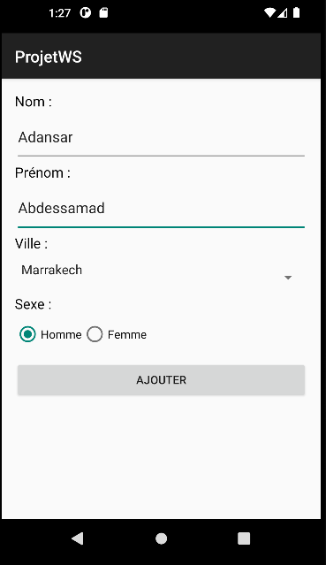
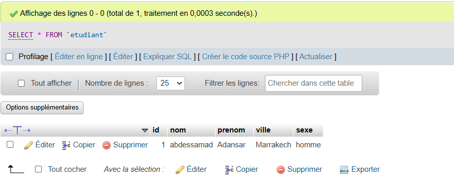

# ProjetWS - Android Lab Report

## 📱 App Screenshots



## 🛠 Technologies Used
- **Language:** Java
- **Framework:** Android SDK
- **Minimum API:** 26 (Android 8.0 Oreo)
- **UI Components:** EditText, Spinner, RadioGroup, RadioButton, Button
- **IDE:** Android Studio
- **Networking:** Volley
- **JSON Parsing:** Gson
- **Backend:** PHP Web Service (Server-side)
- **Dependencies:** 
  - com.android.volley:volley:1.2.1
  - com.google.code.gson:gson:2.10.1

## 💡 Project Idea
Create an Android application that consumes a PHP Web Service to manage students (Etudiants).
Key features include:
- A form to add a student (Name, Surname, City from a Spinner, Gender from a RadioGroup).
- HTTP POST requests using the **Volley** library.
- Deserialization of JSON responses into Java objects using **Gson**.
- Network security configuration to allow cleartext HTTP traffic to `10.0.2.2` (localhost alias in the emulator).

## 🏗 Project Structure

```
ProjetWS/
├── app/
│   ├── src/main/
│   │   ├── java/com/example/projetws/
│   │   │   ├── beans/
│   │   │   │   └── Etudiant.java
│   │   │   └── AddEtudiant.java
│   │   ├── res/
│   │   │   ├── layout/
│   │   │   │   └── activity_add_etudiant.xml
│   │   │   ├── xml/
│   │   │   │   └── network_security_config.xml
│   │   │   ├── values/
│   │   │   │   ├── arrays.xml
│   │   │   │   ├── strings.xml
│   │   │   │   └── styles.xml
│   │   └── AndroidManifest.xml
│   └── build.gradle (Module: app)
```

## 📄 Source Code

### Etudiant.java (beans)
Classe modèle pour un étudiant.

```java
package com.example.projetws.beans;

public class Etudiant {
    private int id;
    private String nom;
    private String prenom;
    private String ville;
    private String sexe;

    public Etudiant() {}

    public Etudiant(int id, String nom, String prenom, String ville, String sexe) {
        this.id = id;
        this.nom = nom;
        this.prenom = prenom;
        this.ville = ville;
        this.sexe = sexe;
    }

    // Getters and Setters omitted for brevity...
    
    @Override
    public String toString() {
        return "Etudiant{id=" + id + ", nom='" + nom + "', prenom='" + prenom + "', ville='" + ville + "', sexe='" + sexe + "'}";
    }
}
```

---

### AddEtudiant.java
Activité contenant le formulaire et la logique d'appel HTTP via Volley.

```java
package com.example.projetws;

import android.os.Bundle;
import android.util.Log;
import android.view.View;
import android.widget.Button;
import android.widget.EditText;
import android.widget.RadioButton;
import android.widget.Spinner;
import android.widget.Toast;
import androidx.appcompat.app.AppCompatActivity;
import com.android.volley.Request;
import com.android.volley.RequestQueue;
import com.android.volley.toolbox.StringRequest;
import com.android.volley.toolbox.Volley;
import com.google.gson.Gson;
import com.google.gson.reflect.TypeToken;
import com.example.projetws.beans.Etudiant;
import java.lang.reflect.Type;
import java.util.Collection;
import java.util.HashMap;
import java.util.Map;

public class AddEtudiant extends AppCompatActivity implements View.OnClickListener {

    private static final String TAG = "AddEtudiant";
    private static final String URL = "http://10.0.2.2/projet/ws/createEtudiant.php";

    private EditText nom, prenom;
    private Spinner ville;
    private RadioButton m, f;
    private Button add;
    private RequestQueue requestQueue;

    @Override
    protected void onCreate(Bundle savedInstanceState) {
        super.onCreate(savedInstanceState);
        setContentView(R.layout.activity_add_etudiant);

        requestQueue = Volley.newRequestQueue(this);

        nom = findViewById(R.id.nom);
        prenom = findViewById(R.id.prenom);
        ville = findViewById(R.id.ville);
        m = findViewById(R.id.m);
        f = findViewById(R.id.f);
        add = findViewById(R.id.add);

        add.setOnClickListener(this);
    }

    @Override
    public void onClick(View v) {
        if (v == add) {
            envoyerEtudiant();
        }
    }

    private void envoyerEtudiant() {
        StringRequest request = new StringRequest(Request.Method.POST, URL,
                response -> {
                    Log.d(TAG, "Réponse brute : " + response);
                    try {
                        Gson gson = new Gson();
                        Type type = new TypeToken<Collection<Etudiant>>() {}.getType();
                        Collection<Etudiant> etudiants = gson.fromJson(response, type);
                        
                        if (etudiants != null) {
                            for (Etudiant etudiant : etudiants) {
                                Log.d(TAG, etudiant.toString());
                            }
                            Toast.makeText(AddEtudiant.this, "Étudiant ajouté avec succès !", Toast.LENGTH_SHORT).show();
                        }
                    } catch (Exception e) {
                        Log.e(TAG, "Erreur parsing JSON : " + e.getMessage());
                    }
                },
                error -> {
                    Log.e(TAG, "Erreur Volley : " + error.getMessage());
                    Toast.makeText(AddEtudiant.this, "Erreur de connexion", Toast.LENGTH_SHORT).show();
                }
        ) {
            @Override
            protected Map<String, String> getParams() {
                Map<String, String> params = new HashMap<>();
                params.put("nom", nom.getText().toString());
                params.put("prenom", prenom.getText().toString());
                params.put("ville", ville.getSelectedItem().toString());
                params.put("sexe", m.isChecked() ? "homme" : "femme");
                return params;
            }
        };

        requestQueue.add(request);
    }
}
```

---

### activity_add_etudiant.xml
Layout contenant le formulaire (extraits).

```xml
<?xml version="1.0" encoding="utf-8"?>
<LinearLayout xmlns:android="http://schemas.android.com/apk/res/android"
    android:layout_width="match_parent"
    android:layout_height="match_parent"
    android:orientation="vertical"
    android:padding="16dp">

    <!-- Elements: nom, prenom, ville(Spinner), sexe(RadioGroup), bouton Ajouter -->
    
</LinearLayout>
```

---

### network_security_config.xml
Configuration permettant le trafic non chiffré vers l'émulateur.

```xml
<?xml version="1.0" encoding="utf-8"?>
<network-security-config>
    <domain-config cleartextTrafficPermitted="true">
        <domain includeSubdomains="true">10.0.2.2</domain>
    </domain-config>
</network-security-config>
```

## 🔑 Key Concepts Demonstrated

### Volley for Networking
- **RequestQueue**: Gère la file d'attente des requêtes HTTP asynchrones.
- **StringRequest**: Requête HTTP qui renvoie une réponse sous forme de String.
- **getParams()**: Redéfinition de la méthode pour envoyer des données en POST (comme un formulaire HTML).

### Gson for JSON Parsing
- `Gson gson = new Gson();` : Initialise le parseur.
- `TypeToken` : Utilisé pour indiquer à Gson le type générique cible de la désérialisation (`Collection<Etudiant>`).
- `fromJson(response, type)` : Convertit la chaîne JSON en objets Java.

### Network Security Config
- Sous Android 9 (API 28) et supérieur, le trafic HTTP (en clair) est bloqué par défaut.
- Utilisation de `android:usesCleartextTraffic="true"` et d'un fichier XML de configuration pour autoriser spécifiquement l'IP `10.0.2.2` (qui correspond à `localhost` de la machine hôte pour l'émulateur).
