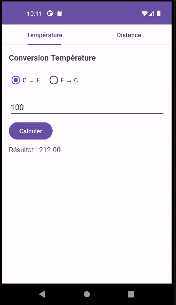
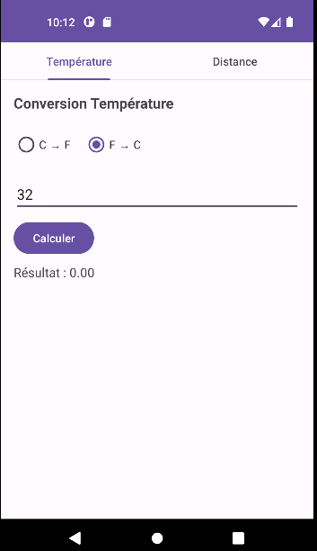
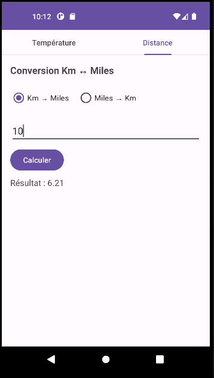
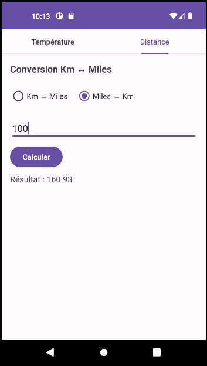
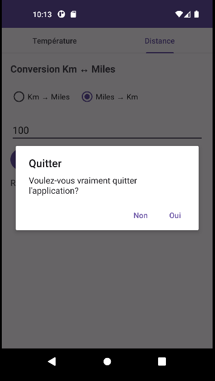

# ConverterTabsJava - Android Lab Report

## 📱 App Screenshots






## 🛠 Technologies Used
- **Language:** Java
- **Framework:** Android SDK
- **Minimum API:** 24 (Android 7.0 Nougat)
- **UI Components:** TabLayout, ViewPager2, RadioGroup, RadioButton, EditText, Button, TextView
- **IDE:** Android Studio
- **Fragment Management:** FragmentStateAdapter, FragmentTransaction
- **Navigation:** TabLayoutMediator for tab-fragment synchronization
- **Dialog:** AlertDialog for exit confirmation
- **Dependencies:**
  - com.google.android.material:material
  - androidx.viewpager2:viewpager2

## 💡 Project Idea
Create a tab-based converter app with two fragments demonstrating:
- Tab navigation with TabLayout and ViewPager2
- Fragment lifecycle management
- Temperature conversion (Celsius ↔ Fahrenheit)
- Distance conversion (Kilometers ↔ Miles)
- Input validation and error handling
- Custom back button behavior with confirmation dialog

## 🏗 Project Structure

```
ConverterTabsJava/
├── app/
│   ├── src/main/
│   │   ├── java/com/example/converttabsjava/
│   │   │   ├── MainActivity.java
│   │   │   ├── ViewPagerAdapter.java
│   │   │   ├── TempFragment.java
│   │   │   └── DistanceFragment.java
│   │   ├── res/
│   │   │   ├── layout/
│   │   │   │   ├── activity_main.xml
│   │   │   │   ├── fragment_temp.xml
│   │   │   │   └── fragment_distance.xml
│   │   │   └── values/
│   │   │       └── strings.xml
│   │   └── AndroidManifest.xml
│   └── build.gradle (Module: app)
```

## 📄 Source Code

### activity_main.xml
Layout principal avec un TabLayout en haut et un ViewPager2 pour afficher les fragments.

```xml
<?xml version="1.0" encoding="utf-8"?>
<!-- Layout principal : TabLayout en haut + ViewPager2 pour les fragments -->
<LinearLayout xmlns:android="http://schemas.android.com/apk/res/android"
    xmlns:app="http://schemas.android.com/apk/res-auto"
    android:layout_width="match_parent"
    android:layout_height="match_parent"
    android:orientation="vertical">

    <!-- Barre d'onglets pour la navigation entre les fragments -->
    <com.google.android.material.tabs.TabLayout
        android:id="@+id/tabLayout"
        android:layout_width="match_parent"
        android:layout_height="wrap_content"
        app:tabIndicatorFullWidth="false"
        app:tabMode="fixed" />

    <!-- Conteneur de pages pour afficher les fragments par balayage -->
    <androidx.viewpager2.widget.ViewPager2
        android:id="@+id/viewPager"
        android:layout_width="match_parent"
        android:layout_height="match_parent" />

</LinearLayout>
```

---

### fragment_temp.xml
Layout du fragment de conversion de température avec RadioGroup, EditText et bouton.

```xml
<?xml version="1.0" encoding="utf-8"?>
<!-- Layout du fragment de conversion de température -->
<LinearLayout xmlns:android="http://schemas.android.com/apk/res/android"
    android:layout_width="match_parent"
    android:layout_height="match_parent"
    android:orientation="vertical"
    android:padding="16dp">

    <!-- Titre du fragment -->
    <TextView
        android:layout_width="wrap_content"
        android:layout_height="wrap_content"
        android:text="@string/conversion_temperature"
        android:textSize="18sp"
        android:textStyle="bold" />

    <!-- Groupe de boutons radio pour choisir le sens de conversion -->
    <RadioGroup
        android:id="@+id/rgTemp"
        android:layout_width="wrap_content"
        android:layout_height="wrap_content"
        android:orientation="horizontal"
        android:layout_marginTop="16dp">

        <!-- Option Celsius vers Fahrenheit (sélectionnée par défaut) -->
        <RadioButton
            android:id="@+id/rbCtoF"
            android:layout_width="wrap_content"
            android:layout_height="wrap_content"
            android:text="@string/c_to_f"
            android:checked="true" />

        <!-- Option Fahrenheit vers Celsius -->
        <RadioButton
            android:id="@+id/rbFtoC"
            android:layout_width="wrap_content"
            android:layout_height="wrap_content"
            android:text="@string/f_to_c"
            android:layout_marginStart="16dp" />
    </RadioGroup>

    <!-- Champ de saisie pour la valeur à convertir -->
    <EditText
        android:id="@+id/etTempInput"
        android:layout_width="match_parent"
        android:layout_height="wrap_content"
        android:hint="@string/hint_entrer_valeur"
        android:inputType="numberDecimal"
        android:layout_marginTop="16dp" />

    <!-- Bouton pour lancer la conversion -->
    <Button
        android:id="@+id/btnConvertTemp"
        android:layout_width="wrap_content"
        android:layout_height="wrap_content"
        android:text="@string/calculer"
        android:layout_marginTop="8dp" />

    <!-- Affichage du résultat de la conversion -->
    <TextView
        android:id="@+id/tvTempResult"
        android:layout_width="wrap_content"
        android:layout_height="wrap_content"
        android:text="@string/resultat_default"
        android:textSize="16sp"
        android:layout_marginTop="8dp" />

</LinearLayout>
```

---

### fragment_distance.xml
Layout du fragment de conversion de distance avec RadioGroup, EditText et bouton.

```xml
<?xml version="1.0" encoding="utf-8"?>
<!-- Layout du fragment de conversion de distance -->
<LinearLayout xmlns:android="http://schemas.android.com/apk/res/android"
    android:layout_width="match_parent"
    android:layout_height="match_parent"
    android:orientation="vertical"
    android:padding="16dp">

    <!-- Titre du fragment -->
    <TextView
        android:layout_width="wrap_content"
        android:layout_height="wrap_content"
        android:text="@string/conversion_distance"
        android:textSize="18sp"
        android:textStyle="bold" />

    <!-- Groupe de boutons radio pour choisir le sens de conversion -->
    <RadioGroup
        android:id="@+id/rgDist"
        android:layout_width="wrap_content"
        android:layout_height="wrap_content"
        android:orientation="horizontal"
        android:layout_marginTop="16dp">

        <!-- Option Kilomètres vers Miles (sélectionnée par défaut) -->
        <RadioButton
            android:id="@+id/rbKmToMiles"
            android:layout_width="wrap_content"
            android:layout_height="wrap_content"
            android:text="@string/km_to_miles"
            android:checked="true" />

        <!-- Option Miles vers Kilomètres -->
        <RadioButton
            android:id="@+id/rbMilesToKm"
            android:layout_width="wrap_content"
            android:layout_height="wrap_content"
            android:text="@string/miles_to_km"
            android:layout_marginStart="16dp" />
    </RadioGroup>

    <!-- Champ de saisie pour la valeur à convertir -->
    <EditText
        android:id="@+id/etDistInput"
        android:layout_width="match_parent"
        android:layout_height="wrap_content"
        android:hint="@string/hint_entrer_valeur"
        android:inputType="numberDecimal"
        android:layout_marginTop="16dp" />

    <!-- Bouton pour lancer la conversion -->
    <Button
        android:id="@+id/btnConvertDist"
        android:layout_width="wrap_content"
        android:layout_height="wrap_content"
        android:text="@string/calculer"
        android:layout_marginTop="8dp" />

    <!-- Affichage du résultat de la conversion -->
    <TextView
        android:id="@+id/tvDistResult"
        android:layout_width="wrap_content"
        android:layout_height="wrap_content"
        android:text="@string/resultat_default"
        android:textSize="16sp"
        android:layout_marginTop="8dp" />

</LinearLayout>
```

---

### MainActivity.java
Activité principale qui gère la navigation par onglets entre les fragments de conversion.

```java
package com.example.converttabsjava;

// Importation des classes nécessaires
import android.os.Bundle;
import androidx.appcompat.app.AlertDialog;
import androidx.appcompat.app.AppCompatActivity;
import androidx.viewpager2.widget.ViewPager2;
import com.google.android.material.tabs.TabLayout;
import com.google.android.material.tabs.TabLayoutMediator;

/**
 * MainActivity - Activité principale de l'application ConverterTabsJava.
 * Gère la navigation par onglets entre les fragments de conversion.
 * Utilise TabLayout + ViewPager2 pour la synchronisation onglet-fragment.
 */
public class MainActivity extends AppCompatActivity {

    // Déclaration des composants de l'interface
    private TabLayout tabLayout;        // Barre d'onglets
    private ViewPager2 viewPager;       // Conteneur de pages
    private ViewPagerAdapter adapter;   // Adaptateur pour les fragments

    /**
     * Méthode appelée à la création de l'activité.
     * Initialise les composants et configure la navigation par onglets.
     */
    @Override
    protected void onCreate(Bundle savedInstanceState) {
        super.onCreate(savedInstanceState);
        // Associer le layout XML à cette activité
        setContentView(R.layout.activity_main);

        // Liaison des composants avec les éléments XML via findViewById
        tabLayout = findViewById(R.id.tabLayout);
        viewPager = findViewById(R.id.viewPager);

        // Initialisation de l'adaptateur avec cette activité
        adapter = new ViewPagerAdapter(this);

        // Associer l'adaptateur au ViewPager2
        viewPager.setAdapter(adapter);

        // Synchroniser le TabLayout avec le ViewPager2 via TabLayoutMediator
        new TabLayoutMediator(tabLayout, viewPager, (tab, position) -> {
            // Définir le texte de chaque onglet selon sa position
            if (position == 0) {
                tab.setText(R.string.tab_temperature);  // Premier onglet : Température
            } else {
                tab.setText(R.string.tab_distance);     // Deuxième onglet : Distance
            }
        }).attach(); // Attacher le médiateur pour activer la synchronisation
    }

    /**
     * Méthode appelée lorsque l'utilisateur appuie sur le bouton retour.
     * Affiche un dialogue de confirmation avant de quitter l'application.
     */
    @SuppressWarnings("deprecation")
    @Override
    public void onBackPressed() {
        // Créer et afficher un dialogue de confirmation
        new AlertDialog.Builder(this)
                .setTitle(R.string.dialog_titre_quitter)      // Titre : "Quitter"
                .setMessage(R.string.dialog_message_quitter)  // Message de confirmation
                .setPositiveButton(R.string.dialog_oui, (dialog, which) -> {
                    // Si l'utilisateur confirme, fermer l'activité
                    finish();
                })
                .setNegativeButton(R.string.dialog_non, null) // Si annulé, ne rien faire
                .show(); // Afficher le dialogue
    }
}
```

---

### ViewPagerAdapter.java
Adaptateur pour le ViewPager2 qui gère la création des fragments.

```java
package com.example.converttabsjava;

// Importation des classes nécessaires
import androidx.annotation.NonNull;
import androidx.fragment.app.Fragment;
import androidx.fragment.app.FragmentActivity;
import androidx.viewpager2.adapter.FragmentStateAdapter;

/**
 * ViewPagerAdapter - Adaptateur pour le ViewPager2.
 * Gère la création des fragments selon la position de l'onglet sélectionné.
 * Position 0 : TempFragment (conversion de température)
 * Position 1 : DistanceFragment (conversion de distance)
 */
public class ViewPagerAdapter extends FragmentStateAdapter {

    /**
     * Constructeur de l'adaptateur.
     *
     * @param fragmentActivity L'activité hôte contenant le ViewPager2
     */
    public ViewPagerAdapter(@NonNull FragmentActivity fragmentActivity) {
        super(fragmentActivity);
    }

    /**
     * Crée le fragment correspondant à la position donnée.
     *
     * @param position La position de l'onglet (0 ou 1)
     * @return Le fragment à afficher pour cette position
     */
    @NonNull
    @Override
    public Fragment createFragment(int position) {
        // Retourner le fragment correspondant à la position
        if (position == 0) {
            return new TempFragment();      // Onglet 0 : fragment température
        } else {
            return new DistanceFragment();  // Onglet 1 : fragment distance
        }
    }

    /**
     * Retourne le nombre total de fragments (onglets).
     *
     * @return 2 (température + distance)
     */
    @Override
    public int getItemCount() {
        return 2; // Deux onglets au total
    }
}
```

---

### TempFragment.java
Fragment de conversion de température (Celsius ↔ Fahrenheit).

```java
package com.example.converttabsjava;

// Importation des classes nécessaires
import android.os.Bundle;
import android.text.TextUtils;
import android.view.LayoutInflater;
import android.view.View;
import android.view.ViewGroup;
import android.widget.Button;
import android.widget.EditText;
import android.widget.RadioButton;
import android.widget.RadioGroup;
import android.widget.TextView;
import android.widget.Toast;
import androidx.annotation.NonNull;
import androidx.annotation.Nullable;
import androidx.fragment.app.Fragment;

/**
 * TempFragment - Fragment de conversion de température.
 * Permet de convertir entre Celsius et Fahrenheit.
 * Formules utilisées :
 *   C → F : (valeur × 1.8) + 32
 *   F → C : (valeur - 32) / 1.8
 */
public class TempFragment extends Fragment {

    // Déclaration des composants de l'interface
    private RadioGroup rgTemp;          // Groupe de boutons radio
    private RadioButton rbCtoF;         // Option Celsius vers Fahrenheit
    private RadioButton rbFtoC;         // Option Fahrenheit vers Celsius
    private EditText etTempInput;       // Champ de saisie de la valeur
    private Button btnConvertTemp;      // Bouton de conversion
    private TextView tvTempResult;      // Affichage du résultat

    /**
     * Méthode appelée pour créer la vue du fragment.
     * Gonfle le layout fragment_temp.xml et initialise les composants.
     *
     * @param inflater           Le LayoutInflater pour gonfler le layout
     * @param container          Le conteneur parent
     * @param savedInstanceState L'état sauvegardé (null au premier lancement)
     * @return La vue racine du fragment
     */
    @Nullable
    @Override
    public View onCreateView(@NonNull LayoutInflater inflater, @Nullable ViewGroup container,
                             @Nullable Bundle savedInstanceState) {
        // Gonfler le layout XML du fragment
        View view = inflater.inflate(R.layout.fragment_temp, container, false);

        // Liaison des composants XML avec les variables Java via findViewById
        rgTemp = view.findViewById(R.id.rgTemp);
        rbCtoF = view.findViewById(R.id.rbCtoF);
        rbFtoC = view.findViewById(R.id.rbFtoC);
        etTempInput = view.findViewById(R.id.etTempInput);
        btnConvertTemp = view.findViewById(R.id.btnConvertTemp);
        tvTempResult = view.findViewById(R.id.tvTempResult);

        // Configuration de l'écouteur de clic sur le bouton de conversion
        btnConvertTemp.setOnClickListener(v -> {
            // Récupérer la valeur saisie par l'utilisateur
            String input = etTempInput.getText().toString();

            // Vérifier si le champ est vide
            if (TextUtils.isEmpty(input)) {
                // Afficher un message d'erreur si aucune valeur n'est saisie
                Toast.makeText(getContext(), R.string.erreur_valeur_vide, Toast.LENGTH_SHORT).show();
                return; // Arrêter l'exécution
            }

            // Convertir la chaîne en nombre décimal
            double val = Double.parseDouble(input);
            double result;

            // Effectuer la conversion selon l'option sélectionnée
            if (rbCtoF.isChecked()) {
                // Conversion Celsius vers Fahrenheit : (C × 1.8) + 32
                result = (val * 1.8) + 32;
            } else {
                // Conversion Fahrenheit vers Celsius : (F - 32) / 1.8
                result = (val - 32) / 1.8;
            }

            // Formater le résultat avec 2 décimales et l'afficher
            String formattedResult = String.format("%.2f", result);
            tvTempResult.setText("Résultat : " + formattedResult);
        });

        // Retourner la vue construite
        return view;
    }
}
```

---

### DistanceFragment.java
Fragment de conversion de distance (Kilomètres ↔ Miles).

```java
package com.example.converttabsjava;

// Importation des classes nécessaires
import android.os.Bundle;
import android.text.TextUtils;
import android.view.LayoutInflater;
import android.view.View;
import android.view.ViewGroup;
import android.widget.Button;
import android.widget.EditText;
import android.widget.RadioButton;
import android.widget.RadioGroup;
import android.widget.TextView;
import android.widget.Toast;
import androidx.annotation.NonNull;
import androidx.annotation.Nullable;
import androidx.fragment.app.Fragment;

/**
 * DistanceFragment - Fragment de conversion de distance.
 * Permet de convertir entre Kilomètres et Miles.
 * Formules utilisées :
 *   Km → Miles : valeur × 0.6214
 *   Miles → Km : valeur / 0.6214
 */
public class DistanceFragment extends Fragment {

    // Déclaration des composants de l'interface
    private RadioGroup rgDist;          // Groupe de boutons radio
    private RadioButton rbKmToMiles;    // Option Kilomètres vers Miles
    private RadioButton rbMilesToKm;    // Option Miles vers Kilomètres
    private EditText etDistInput;       // Champ de saisie de la valeur
    private Button btnConvertDist;      // Bouton de conversion
    private TextView tvDistResult;      // Affichage du résultat

    /**
     * Méthode appelée pour créer la vue du fragment.
     * Gonfle le layout fragment_distance.xml et initialise les composants.
     *
     * @param inflater           Le LayoutInflater pour gonfler le layout
     * @param container          Le conteneur parent
     * @param savedInstanceState L'état sauvegardé (null au premier lancement)
     * @return La vue racine du fragment
     */
    @Nullable
    @Override
    public View onCreateView(@NonNull LayoutInflater inflater, @Nullable ViewGroup container,
                             @Nullable Bundle savedInstanceState) {
        // Gonfler le layout XML du fragment
        View view = inflater.inflate(R.layout.fragment_distance, container, false);

        // Liaison des composants XML avec les variables Java via findViewById
        rgDist = view.findViewById(R.id.rgDist);
        rbKmToMiles = view.findViewById(R.id.rbKmToMiles);
        rbMilesToKm = view.findViewById(R.id.rbMilesToKm);
        etDistInput = view.findViewById(R.id.etDistInput);
        btnConvertDist = view.findViewById(R.id.btnConvertDist);
        tvDistResult = view.findViewById(R.id.tvDistResult);

        // Configuration de l'écouteur de clic sur le bouton de conversion
        btnConvertDist.setOnClickListener(v -> {
            // Récupérer la valeur saisie par l'utilisateur
            String input = etDistInput.getText().toString();

            // Vérifier si le champ est vide
            if (TextUtils.isEmpty(input)) {
                // Afficher un message d'erreur si aucune valeur n'est saisie
                Toast.makeText(getContext(), R.string.erreur_valeur_vide, Toast.LENGTH_SHORT).show();
                return; // Arrêter l'exécution
            }

            // Convertir la chaîne en nombre décimal
            double val = Double.parseDouble(input);
            double result;

            // Effectuer la conversion selon l'option sélectionnée
            if (rbKmToMiles.isChecked()) {
                // Conversion Kilomètres vers Miles : Km × 0.6214
                result = val * 0.6214;
            } else {
                // Conversion Miles vers Kilomètres : Miles / 0.6214
                result = val / 0.6214;
            }

            // Formater le résultat avec 2 décimales et l'afficher
            String formattedResult = String.format("%.2f", result);
            tvDistResult.setText("Résultat : " + formattedResult);
        });

        // Retourner la vue construite
        return view;
    }
}
```

## 🔑 Key Concepts Demonstrated

### TabLayout & ViewPager2
- `TabLayout` : Barre d'onglets Material Design pour la navigation
- `ViewPager2` : Conteneur de pages avec balayage horizontal
- `TabLayoutMediator` : Synchronise les onglets avec les pages
- `FragmentStateAdapter` : Gère le cycle de vie des fragments dans ViewPager2

### Fragment Lifecycle
- `onCreateView()` : Gonflement du layout et initialisation des composants
- Chaque fragment est indépendant et autonome

### Conversion Formulas
- **Température** : C → F = (C × 1.8) + 32 | F → C = (F - 32) / 1.8
- **Distance** : Km → Miles = Km × 0.6214 | Miles → Km = Miles / 0.6214

### Input Validation
- `TextUtils.isEmpty()` : Vérification de champ vide
- `Toast` : Feedback utilisateur en cas d'erreur
- `String.format("%.2f", result)` : Formatage à 2 décimales

### Custom Back Button
- `onBackPressed()` : Interception du bouton retour
- `AlertDialog` : Dialogue de confirmation avant de quitter
