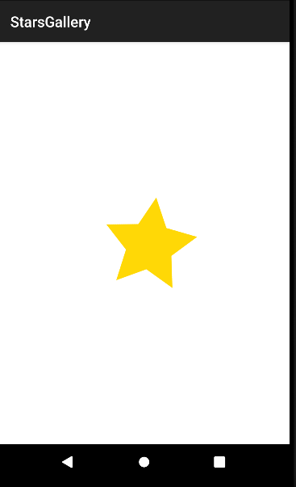
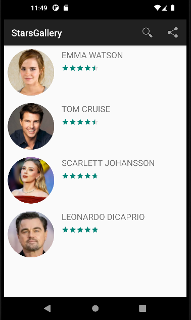
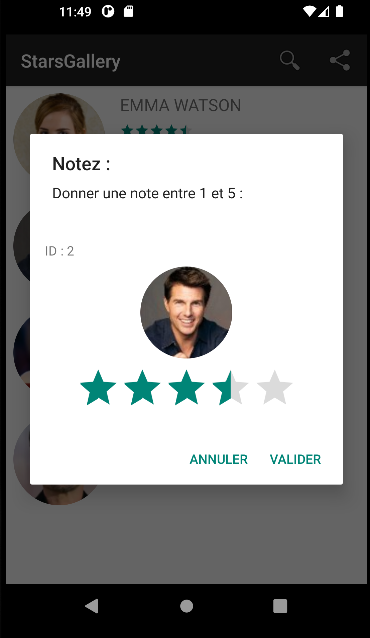
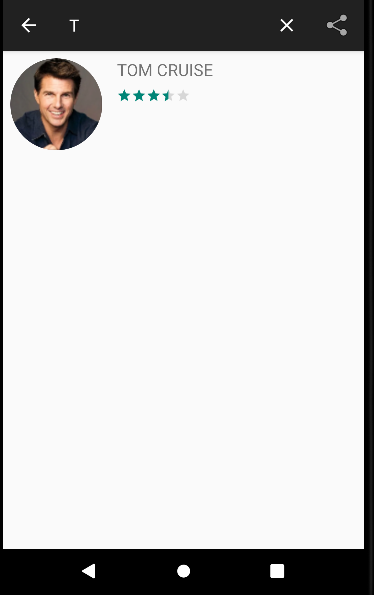

# StarsGallery - Android Lab Report

## 📱 App Screenshots





## 🛠 Technologies Used
- **Language:** Java
- **Framework:** Android SDK
- **Minimum API:** 24 (Android 7.0 Nougat)
- **UI Components:** RecyclerView, SearchView, RatingBar, CircleImageView, AlertDialog
- **IDE:** Android Studio
- **Architecture:** MVC Pattern with DAO and Service layers
- **Image Loading:** Glide (with circular image transformation)
- **Animations:** ViewPropertyAnimator (rotation, scale, translation, alpha)
- **Filtering:** Custom Filter implementation with Filterable interface
- **Dependencies:**
  - androidx.recyclerview:recyclerview
  - de.hdodenhof:circleimageview
  - com.github.bumptech.glide:glide

## 💡 Project Idea
Create a complete star gallery app demonstrating:
- Animated splash screen with multiple visual effects
- RecyclerView with custom adapter and ViewHolder pattern
- Circular image loading from URLs using Glide
- Dynamic filtering with SearchView
- CRUD operations with Singleton Service pattern
- Rating modification via custom AlertDialog popup
- Share functionality via Intent
- Clean architecture with separated packages (beans, dao, service, adapter, ui)

## 🏗 Project Structure

```
StarsGallery/
├── app/
│   ├── src/main/
│   │   ├── java/com/example/starsgallery/
│   │   │   ├── beans/
│   │   │   │   └── Star.java
│   │   │   ├── dao/
│   │   │   │   └── IDao.java
│   │   │   ├── service/
│   │   │   │   └── StarService.java
│   │   │   ├── adapter/
│   │   │   │   └── StarAdapter.java
│   │   │   └── ui/
│   │   │       ├── SplashActivity.java
│   │   │       └── ListActivity.java
│   │   ├── res/
│   │   │   ├── layout/
│   │   │   │   ├── activity_splash.xml
│   │   │   │   ├── activity_list.xml
│   │   │   │   ├── star_item.xml
│   │   │   │   └── star_edit_item.xml
│   │   │   ├── menu/
│   │   │   │   └── menu.xml
│   │   │   ├── drawable/
│   │   │   │   └── star.xml
│   │   │   └── values/
│   │   │       └── strings.xml
│   │   └── AndroidManifest.xml
│   └── build.gradle (Module: app)
```

## 📄 Source Code

### Star.java (beans)
Classe modèle représentant une star avec auto-incrémentation de l'id.

```java
package com.example.starsgallery.beans;

public class Star {
    private static int comp = 0;
    private int id;
    private String name;
    private String img;
    private float rating;

    public Star(String name, String img, float rating) {
        this.id = ++comp;
        this.name = name;
        this.img = img;
        this.rating = rating;
    }

    public int getId() { return id; }
    public void setId(int id) { this.id = id; }
    public String getName() { return name; }
    public void setName(String name) { this.name = name; }
    public String getImg() { return img; }
    public void setImg(String img) { this.img = img; }
    public float getRating() { return rating; }
    public void setRating(float rating) { this.rating = rating; }
}
```

---

### IDao.java (dao)
Interface générique pour les opérations CRUD.

```java
package com.example.starsgallery.dao;

import java.util.List;

public interface IDao<T> {
    boolean create(T o);
    boolean update(T o);
    boolean delete(T o);
    T findById(int id);
    List<T> findAll();
}
```

---

### StarService.java (service)
Service singleton implémentant les opérations CRUD pour les stars.

```java
package com.example.starsgallery.service;

import com.example.starsgallery.beans.Star;
import com.example.starsgallery.dao.IDao;
import java.util.ArrayList;
import java.util.List;

public class StarService implements IDao<Star> {
    private static StarService instance;
    private List<Star> stars;

    private StarService() {
        stars = new ArrayList<>();
        seed();
    }

    public static StarService getInstance() {
        if (instance == null) { instance = new StarService(); }
        return instance;
    }

    private void seed() {
        stars.add(new Star("Emma Watson", "https://i.imgur.com/5KqGvYu.jpg", 4.5f));
        stars.add(new Star("Tom Cruise", "https://i.imgur.com/8JXQZ8c.jpg", 4.2f));
        stars.add(new Star("Scarlett Johansson", "https://i.imgur.com/3VxqN7K.jpg", 4.7f));
        stars.add(new Star("Leonardo DiCaprio", "https://i.imgur.com/9h5dRqL.jpg", 4.8f));
    }

    @Override public boolean create(Star star) { return stars.add(star); }
    @Override public boolean update(Star star) {
        for (int i = 0; i < stars.size(); i++) {
            if (stars.get(i).getId() == star.getId()) { stars.set(i, star); return true; }
        }
        return false;
    }
    @Override public boolean delete(Star star) { return stars.remove(star); }
    @Override public Star findById(int id) {
        for (Star star : stars) { if (star.getId() == id) return star; }
        return null;
    }
    @Override public List<Star> findAll() { return stars; }
}
```

---

### activity_splash.xml
Layout du Splash Screen avec logo centré.

```xml
<?xml version="1.0" encoding="utf-8"?>
<androidx.constraintlayout.widget.ConstraintLayout xmlns:android="http://schemas.android.com/apk/res/android"
    xmlns:app="http://schemas.android.com/apk/res-auto"
    android:layout_width="match_parent"
    android:layout_height="match_parent"
    android:background="#FFFFFF">
    <ImageView
        android:id="@+id/logo"
        android:layout_width="150dp"
        android:layout_height="150dp"
        android:src="@drawable/star"
        app:layout_constraintBottom_toBottomOf="parent"
        app:layout_constraintEnd_toEndOf="parent"
        app:layout_constraintStart_toStartOf="parent"
        app:layout_constraintTop_toTopOf="parent" />
</androidx.constraintlayout.widget.ConstraintLayout>
```

---

### SplashActivity.java (ui)
Écran de démarrage animé avec redirection automatique.

```java
package com.example.starsgallery.ui;

import android.content.Intent;
import android.os.Bundle;
import android.widget.ImageView;
import androidx.appcompat.app.AppCompatActivity;
import com.example.starsgallery.R;

public class SplashActivity extends AppCompatActivity {
    @Override
    protected void onCreate(Bundle savedInstanceState) {
        super.onCreate(savedInstanceState);
        setContentView(R.layout.activity_splash);
        ImageView logo = findViewById(R.id.logo);

        logo.animate().rotation(360f).setDuration(2000);
        logo.animate().scaleX(0.5f).scaleY(0.5f).setDuration(3000);
        logo.animate().translationXBy(1000f).setDuration(2000);
        logo.animate().alpha(0f).setDuration(6000);

        new Thread(() -> {
            try { Thread.sleep(5000); } catch (InterruptedException e) { e.printStackTrace(); }
            startActivity(new Intent(SplashActivity.this, ListActivity.class));
            finish();
        }).start();
    }
}
```

---

### activity_list.xml
Layout avec RecyclerView.

```xml
<?xml version="1.0" encoding="utf-8"?>
<LinearLayout xmlns:android="http://schemas.android.com/apk/res/android"
    android:layout_width="match_parent"
    android:layout_height="match_parent"
    android:orientation="vertical">
    <androidx.recyclerview.widget.RecyclerView
        android:id="@+id/recycle_view"
        android:layout_width="match_parent"
        android:layout_height="match_parent" />
</LinearLayout>
```

---

### star_item.xml
Layout d'un élément de la liste.

```xml
<?xml version="1.0" encoding="utf-8"?>
<RelativeLayout xmlns:android="http://schemas.android.com/apk/res/android"
    android:layout_width="match_parent"
    android:layout_height="wrap_content"
    android:padding="8dp">
    <de.hdodenhof.circleimageview.CircleImageView
        android:id="@+id/imgStar"
        android:layout_width="100dp"
        android:layout_height="100dp"
        android:src="@drawable/star" />
    <TextView
        android:id="@+id/tvName"
        android:layout_width="wrap_content"
        android:layout_height="wrap_content"
        android:layout_toEndOf="@id/imgStar"
        android:layout_marginStart="16dp"
        android:textSize="18sp" />
    <RatingBar
        android:id="@+id/rating"
        style="?android:attr/ratingBarStyleSmall"
        android:layout_width="wrap_content"
        android:layout_height="wrap_content"
        android:layout_below="@id/tvName"
        android:layout_toEndOf="@id/imgStar"
        android:layout_marginStart="16dp"
        android:layout_marginTop="8dp"
        android:numStars="5"
        android:isIndicator="true"
        android:stepSize="0.1" />
</RelativeLayout>
```

---

### star_edit_item.xml
Layout de la popup d'édition.

```xml
<?xml version="1.0" encoding="utf-8"?>
<LinearLayout xmlns:android="http://schemas.android.com/apk/res/android"
    android:layout_width="match_parent"
    android:layout_height="wrap_content"
    android:orientation="vertical"
    android:padding="16dp">
    <TextView android:id="@+id/idss"
        android:layout_width="wrap_content"
        android:layout_height="wrap_content" />
    <de.hdodenhof.circleimageview.CircleImageView
        android:id="@+id/img"
        android:layout_width="100dp"
        android:layout_height="100dp"
        android:layout_gravity="center"
        android:layout_marginTop="8dp" />
    <RatingBar android:id="@+id/rating"
        android:layout_width="wrap_content"
        android:layout_height="wrap_content"
        android:layout_gravity="center"
        android:layout_marginTop="8dp"
        android:numStars="5"
        android:stepSize="0.1" />
</LinearLayout>
```

---

### StarAdapter.java (adapter)
Adaptateur RecyclerView avec filtrage et popup de notation.

```java
package com.example.starsgallery.adapter;

import android.content.Context;
import android.view.LayoutInflater;
import android.view.View;
import android.view.ViewGroup;
import android.widget.Filter;
import android.widget.Filterable;
import android.widget.ImageView;
import android.widget.RatingBar;
import android.widget.TextView;
import androidx.annotation.NonNull;
import androidx.appcompat.app.AlertDialog;
import androidx.recyclerview.widget.RecyclerView;
import com.bumptech.glide.Glide;
import com.example.starsgallery.R;
import com.example.starsgallery.beans.Star;
import com.example.starsgallery.service.StarService;
import java.util.ArrayList;
import java.util.List;
import de.hdodenhof.circleimageview.CircleImageView;

public class StarAdapter extends RecyclerView.Adapter<StarAdapter.StarViewHolder> implements Filterable {
    private List<Star> stars;
    private List<Star> starsFilter;
    private Context context;
    private NewFilter mfilter;

    public StarAdapter(Context context, List<Star> stars) {
        this.context = context;
        this.stars = stars;
        this.starsFilter = new ArrayList<>(stars);
        this.mfilter = new NewFilter(this);
    }

    @NonNull
    @Override
    public StarViewHolder onCreateViewHolder(@NonNull ViewGroup parent, int viewType) {
        View view = LayoutInflater.from(context).inflate(R.layout.star_item, parent, false);
        view.setOnClickListener(v -> {
            int position = ((RecyclerView) parent).getChildAdapterPosition(v);
            if (position == RecyclerView.NO_POSITION) return;
            Star star = starsFilter.get(position);
            View popupView = LayoutInflater.from(context).inflate(R.layout.star_edit_item, null);
            ImageView popupImg = popupView.findViewById(R.id.img);
            RatingBar popupRating = popupView.findViewById(R.id.rating);
            TextView popupId = popupView.findViewById(R.id.idss);
            Glide.with(context).load(star.getImg()).override(100, 100).into(popupImg);
            popupRating.setRating(star.getRating());
            popupId.setText("ID : " + star.getId());
            new AlertDialog.Builder(context)
                .setTitle(R.string.notez).setMessage(R.string.donner_note).setView(popupView)
                .setPositiveButton(R.string.valider, (dialog, which) -> {
                    Star s = StarService.getInstance().findById(star.getId());
                    if (s != null) {
                        s.setRating(popupRating.getRating());
                        StarService.getInstance().update(s);
                        notifyItemChanged(position);
                    }
                })
                .setNegativeButton(R.string.annuler, null).show();
        });
        return new StarViewHolder(view);
    }

    @Override
    public void onBindViewHolder(@NonNull StarViewHolder holder, int position) {
        Star star = starsFilter.get(position);
        Glide.with(context).asBitmap().load(star.getImg()).override(100, 100).into(holder.img);
        holder.name.setText(star.getName().toUpperCase());
        holder.rating.setRating(star.getRating());
    }

    @Override public int getItemCount() { return starsFilter.size(); }
    @Override public Filter getFilter() { return mfilter; }

    public static class StarViewHolder extends RecyclerView.ViewHolder {
        CircleImageView img;
        TextView name;
        RatingBar rating;
        public StarViewHolder(@NonNull View itemView) {
            super(itemView);
            img = itemView.findViewById(R.id.imgStar);
            name = itemView.findViewById(R.id.tvName);
            rating = itemView.findViewById(R.id.rating);
        }
    }

    public class NewFilter extends Filter {
        public RecyclerView.Adapter mAdapter;
        public NewFilter(RecyclerView.Adapter mAdapter) { this.mAdapter = mAdapter; }

        @Override
        protected FilterResults performFiltering(CharSequence charSequence) {
            List<Star> filteredList = new ArrayList<>();
            String filterPattern = charSequence.toString().toLowerCase().trim();
            if (filterPattern.isEmpty()) { filteredList.addAll(stars); }
            else {
                for (Star star : stars) {
                    if (star.getName().toLowerCase().startsWith(filterPattern)) filteredList.add(star);
                }
            }
            FilterResults results = new FilterResults();
            results.values = filteredList;
            results.count = filteredList.size();
            return results;
        }

        @SuppressWarnings("unchecked")
        @Override
        protected void publishResults(CharSequence charSequence, FilterResults filterResults) {
            starsFilter.clear();
            starsFilter.addAll((List<Star>) filterResults.values);
            mAdapter.notifyDataSetChanged();
        }
    }
}
```

---

### ListActivity.java (ui)
Activité affichant la galerie avec recherche et partage.

```java
package com.example.starsgallery.ui;

import android.content.Intent;
import android.os.Bundle;
import android.view.Menu;
import android.view.MenuItem;
import androidx.appcompat.app.AppCompatActivity;
import androidx.appcompat.widget.SearchView;
import androidx.recyclerview.widget.LinearLayoutManager;
import androidx.recyclerview.widget.RecyclerView;
import com.example.starsgallery.R;
import com.example.starsgallery.adapter.StarAdapter;
import com.example.starsgallery.beans.Star;
import com.example.starsgallery.service.StarService;
import java.util.List;

public class ListActivity extends AppCompatActivity {
    private RecyclerView recyclerView;
    private StarAdapter starAdapter;
    private StarService starService;

    @Override
    protected void onCreate(Bundle savedInstanceState) {
        super.onCreate(savedInstanceState);
        setContentView(R.layout.activity_list);
        starService = StarService.getInstance();
        recyclerView = findViewById(R.id.recycle_view);
        recyclerView.setLayoutManager(new LinearLayoutManager(this));
        List<Star> stars = starService.findAll();
        starAdapter = new StarAdapter(this, stars);
        recyclerView.setAdapter(starAdapter);
    }

    @Override
    public boolean onCreateOptionsMenu(Menu menu) {
        getMenuInflater().inflate(R.menu.menu, menu);
        MenuItem searchItem = menu.findItem(R.id.app_bar_search);
        SearchView searchView = (SearchView) searchItem.getActionView();
        searchView.setOnQueryTextListener(new SearchView.OnQueryTextListener() {
            @Override public boolean onQueryTextSubmit(String query) { return true; }
            @Override public boolean onQueryTextChange(String newText) {
                starAdapter.getFilter().filter(newText);
                return true;
            }
        });
        return true;
    }

    @Override
    public boolean onOptionsItemSelected(MenuItem item) {
        if (item.getItemId() == R.id.app_bar_share) {
            Intent shareIntent = new Intent(Intent.ACTION_SEND);
            shareIntent.setType("text/plain");
            shareIntent.putExtra(Intent.EXTRA_TEXT, "Stars");
            startActivity(Intent.createChooser(shareIntent, "Partager via"));
            return true;
        }
        return super.onOptionsItemSelected(item);
    }
}
```

---

### menu.xml
Menu avec recherche et partage.

```xml
<?xml version="1.0" encoding="utf-8"?>
<menu xmlns:android="http://schemas.android.com/apk/res/android"
    xmlns:app="http://schemas.android.com/apk/res-auto">
    <item android:id="@+id/app_bar_search"
        android:icon="@android:drawable/ic_menu_search"
        android:title="@string/search"
        app:actionViewClass="androidx.appcompat.widget.SearchView"
        app:showAsAction="always|collapseActionView" />
    <item android:id="@+id/app_bar_share"
        android:icon="@android:drawable/ic_menu_share"
        android:title="@string/partager"
        app:showAsAction="ifRoom" />
</menu>
```

## 🔑 Key Concepts Demonstrated

### RecyclerView Pattern
- `RecyclerView.Adapter` : Adaptateur personnalisé pour la liste
- `ViewHolder` : Pattern de réutilisation des vues
- `LinearLayoutManager` : Gestionnaire de disposition verticale

### Singleton Service Pattern
- `StarService.getInstance()` : Instance unique du service
- Séparation DAO / Service pour une architecture propre

### Glide Image Loading
- Chargement d'images depuis des URLs
- Redimensionnement avec `override(100, 100)`
- Affichage dans CircleImageView

### Filter & SearchView
- `Filterable` interface pour le filtrage dynamique
- `Filter.performFiltering()` en arrière-plan
- `Filter.publishResults()` sur le thread principal

### Animations (Splash Screen)
- `rotation(360f)` : Rotation complète
- `scaleX/Y(0.5f)` : Réduction de taille
- `translationXBy(1000f)` : Déplacement horizontal
- `alpha(0f)` : Fondu progressif
