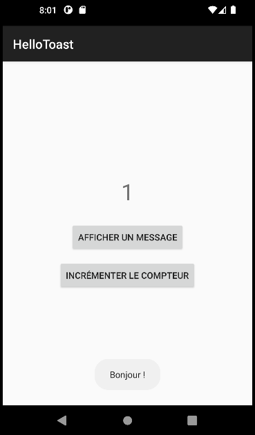

# HelloToast - Android Lab Report

## 📱 App Screenshots

### Initial Screen
![Initial state with counter at 0]

### After Toast Button Click
![Toast message appearing]

### After Count Button Click (multiple times)
![Counter showing 5 or any number]

## 🛠 Technologies Used
- **Language:** Java
- **Framework:** Android SDK
- **Minimum API:** 24 (Android 7.0 Nougat)
- **UI Layout:** LinearLayout with XML
- **Components:** TextView, Button, Toast
- **IDE:** Android Studio
- **Event Handling:** OnClickListener with lambdas

## 💡 Project Idea
Create a simple interactive app demonstrating:
- UI design in XML
- Event-driven programming
- State management (counter variable)
- User feedback using Toast messages

## 🏗 Project Structure

HelloToast/
├── app/
│ ├── src/main/
│ │ ├── java/com/example/hellotoast/
│ │ │ └── MainActivity.java
│ │ ├── res/
│ │ │ ├── layout/
│ │ │ │ └── activity_main.xml
│ │ │ └── values/
│ │ │ └── strings.xml
│ │ └── AndroidManifest.xml

