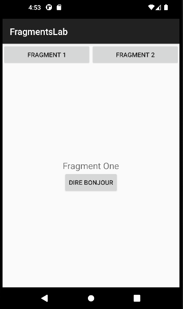
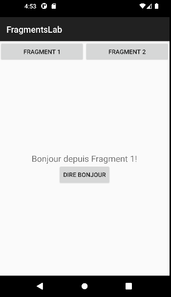
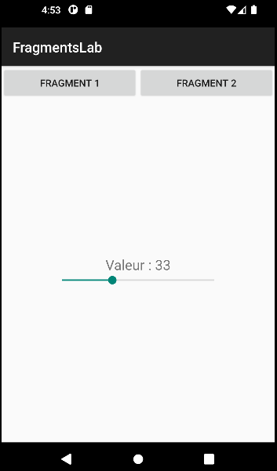

# FragmentsLab - Android Lab Report

## 📱 App Screenshots




## 🛠 Technologies Used
- **Language:** Java
- **Framework:** Android SDK
- **Minimum API:** 24 (Android 7.0 Nougat)
- **UI Layout:** LinearLayout with XML
- **Components:** Button, FrameLayout, TextView, SeekBar
- **IDE:** Android Studio
- **Fragment Management:** FragmentManager, FragmentTransaction
- **State Management:** onSaveInstanceState() for rotation handling
- **Event Handling:** OnClickListener, OnSeekBarChangeListener

## 💡 Project Idea
Create a dynamic fragment-based app demonstrating:
- Dynamic fragment loading with FragmentManager
- Navigation between fragments with back stack
- Fragment lifecycle management
- UI state persistence during rotation
- Interactive components inside fragments (SeekBar, Button)
- Event handling within fragments

## 🏗 Project Structure

```
FragmentsLab/
├── app/
│   ├── src/main/
│   │   ├── java/com/example/fragmentslab/
│   │   │   ├── MainActivity.java
│   │   │   ├── FragmentOne.java
│   │   │   └── FragmentTwo.java
│   │   ├── res/
│   │   │   ├── layout/
│   │   │   │   ├── activity_main.xml
│   │   │   │   ├── fragment_one.xml
│   │   │   │   └── fragment_two.xml
│   │   │   └── values/
│   │   │       └── strings.xml
│   │   └── AndroidManifest.xml
```

## 📄 Source Code

### activity_main.xml
Layout principal avec une barre de navigation horizontale (2 boutons) et un conteneur FrameLayout pour les fragments.

```xml
<?xml version="1.0" encoding="utf-8"?>
<!-- Layout principal : conteneur vertical avec boutons de navigation et zone de fragments -->
<LinearLayout xmlns:android="http://schemas.android.com/apk/res/android"
    android:layout_width="match_parent"
    android:layout_height="match_parent"
    android:orientation="vertical">

    <!-- Barre de navigation horizontale contenant les deux boutons -->
    <LinearLayout
        android:layout_width="match_parent"
        android:layout_height="wrap_content"
        android:orientation="horizontal">

        <!-- Bouton pour afficher Fragment 1 (poids égal) -->
        <Button
            android:id="@+id/btnFragment1"
            android:layout_width="0dp"
            android:layout_height="wrap_content"
            android:layout_weight="1"
            android:text="@string/fragment1" />

        <!-- Bouton pour afficher Fragment 2 (poids égal) -->
        <Button
            android:id="@+id/btnFragment2"
            android:layout_width="0dp"
            android:layout_height="wrap_content"
            android:layout_weight="1"
            android:text="@string/fragment2" />
    </LinearLayout>

    <!-- Conteneur pour l'affichage dynamique des fragments -->
    <FrameLayout
        android:id="@+id/fragment_container"
        android:layout_width="match_parent"
        android:layout_height="0dp"
        android:layout_weight="1" />

</LinearLayout>
```

---

### fragment_one.xml
Layout du premier fragment avec un TextView et un bouton centré.

```xml
<?xml version="1.0" encoding="utf-8"?>
<!-- Layout du Fragment 1 : texte et bouton centré -->
<LinearLayout xmlns:android="http://schemas.android.com/apk/res/android"
    android:layout_width="match_parent"
    android:layout_height="match_parent"
    android:gravity="center"
    android:orientation="vertical"
    android:padding="24dp">

    <!-- Titre du fragment -->
    <TextView
        android:id="@+id/textOne"
        android:layout_width="wrap_content"
        android:layout_height="wrap_content"
        android:text="@string/fragment_one_title"
        android:textSize="20sp" />

    <!-- Bouton pour dire bonjour -->
    <Button
        android:id="@+id/btnHello"
        android:layout_width="wrap_content"
        android:layout_height="wrap_content"
        android:text="@string/dire_bonjour" />

</LinearLayout>
```

---

### fragment_two.xml
Layout du deuxième fragment avec un SeekBar et un afficheur de valeur.

```xml
<?xml version="1.0" encoding="utf-8"?>
<!-- Layout du Fragment 2 : texte de valeur et SeekBar centré -->
<LinearLayout xmlns:android="http://schemas.android.com/apk/res/android"
    android:layout_width="match_parent"
    android:layout_height="match_parent"
    android:gravity="center"
    android:orientation="vertical"
    android:padding="24dp">

    <!-- Affichage de la valeur actuelle du SeekBar -->
    <TextView
        android:id="@+id/tvValue"
        android:layout_width="wrap_content"
        android:layout_height="wrap_content"
        android:text="@string/valeur_default"
        android:textSize="20sp" />

    <!-- Barre de progression interactive -->
    <SeekBar
        android:id="@+id/seekBar"
        android:layout_width="250dp"
        android:layout_height="wrap_content"
        android:max="100" />

</LinearLayout>
```

---

### MainActivity.java
Activité principale qui gère la navigation entre les fragments.

```java
package com.example.fragmentslab;

// Importation des classes nécessaires
import android.os.Bundle;
import android.widget.Button;
import androidx.appcompat.app.AppCompatActivity;
import androidx.fragment.app.Fragment;
import androidx.fragment.app.FragmentManager;
import androidx.fragment.app.FragmentTransaction;

/**
 * MainActivity - Activité principale de l'application FragmentsLab.
 * Gère la navigation entre les fragments via deux boutons.
 * Utilise FragmentManager et FragmentTransaction pour le remplacement dynamique.
 */
public class MainActivity extends AppCompatActivity {

    // Déclaration des boutons de navigation
    private Button btn1;  // Bouton pour afficher Fragment 1
    private Button btn2;  // Bouton pour afficher Fragment 2

    /**
     * Méthode appelée à la création de l'activité.
     * Initialise les boutons et affiche le premier fragment par défaut.
     */
    @Override
    protected void onCreate(Bundle savedInstanceState) {
        super.onCreate(savedInstanceState);
        // Associer le layout XML à cette activité
        setContentView(R.layout.activity_main);

        // Liaison des boutons avec les composants XML via findViewById
        btn1 = findViewById(R.id.btnFragment1);
        btn2 = findViewById(R.id.btnFragment2);

        // Afficher FragmentOne par défaut uniquement au premier lancement
        // (pas lors d'une rotation d'écran)
        if (savedInstanceState == null) {
            replaceFragment(new FragmentOne(), false);
        }

        // Écouteur de clic sur le bouton Fragment 1
        btn1.setOnClickListener(v -> replaceFragment(new FragmentOne(), true));

        // Écouteur de clic sur le bouton Fragment 2
        btn2.setOnClickListener(v -> replaceFragment(new FragmentTwo(), true));
    }

    /**
     * Méthode privée pour remplacer le fragment affiché dans le conteneur.
     *
     * @param fragment      Le fragment à afficher
     * @param addToBackStack Si vrai, ajoute la transaction à la pile de retour
     *                       pour permettre la navigation avec le bouton retour
     */
    private void replaceFragment(Fragment fragment, boolean addToBackStack) {
        // Obtenir le FragmentManager pour gérer les fragments
        FragmentManager fragmentManager = getSupportFragmentManager();

        // Démarrer une transaction de fragment avec réordonnancement autorisé
        FragmentTransaction transaction = fragmentManager.beginTransaction()
                .setReorderingAllowed(true)
                .replace(R.id.fragment_container, fragment);

        // Ajouter à la pile de retour si demandé
        if (addToBackStack) {
            transaction.addToBackStack(null);
        }

        // Valider la transaction
        transaction.commit();
    }
}
```

---

### FragmentOne.java
Premier fragment avec un bouton interactif qui modifie le texte affiché.

```java
package com.example.fragmentslab;

// Importation des classes nécessaires
import android.os.Bundle;
import android.view.View;
import android.widget.Button;
import android.widget.TextView;
import androidx.annotation.NonNull;
import androidx.annotation.Nullable;
import androidx.fragment.app.Fragment;

/**
 * FragmentOne - Premier fragment de l'application.
 * Affiche un texte et un bouton qui change le message au clic.
 * Démontre l'interaction utilisateur basique dans un fragment.
 */
public class FragmentOne extends Fragment {

    /**
     * Constructeur : associe le layout fragment_one.xml à ce fragment.
     */
    public FragmentOne() {
        super(R.layout.fragment_one);
    }

    /**
     * Méthode appelée après la création de la vue du fragment.
     * Initialise les composants et configure les écouteurs d'événements.
     *
     * @param view               La vue racine du fragment
     * @param savedInstanceState L'état sauvegardé (null au premier lancement)
     */
    @Override
    public void onViewCreated(@NonNull View view, @Nullable Bundle savedInstanceState) {
        super.onViewCreated(view, savedInstanceState);

        // Liaison des composants XML avec les variables Java
        TextView textOne = view.findViewById(R.id.textOne);
        Button btnHello = view.findViewById(R.id.btnHello);

        // Écouteur de clic : changer le texte du TextView au clic sur le bouton
        btnHello.setOnClickListener(v -> textOne.setText(R.string.bonjour_message));
    }
}
```

---

### FragmentTwo.java
Deuxième fragment avec un SeekBar interactif et gestion de la rotation d'écran.

```java
package com.example.fragmentslab;

// Importation des classes nécessaires
import android.os.Bundle;
import android.view.View;
import android.widget.SeekBar;
import android.widget.TextView;
import androidx.annotation.NonNull;
import androidx.annotation.Nullable;
import androidx.fragment.app.Fragment;

/**
 * FragmentTwo - Deuxième fragment de l'application.
 * Affiche un SeekBar interactif avec la valeur actuelle.
 * Gère la persistance de l'état lors de la rotation de l'écran.
 */
public class FragmentTwo extends Fragment {

    // Déclaration des composants de l'interface
    private TextView tvValue;   // Affichage de la valeur du SeekBar
    private SeekBar seek;       // Barre de progression interactive

    // Variable pour stocker la progression actuelle
    private int progress = 0;

    // Clé pour sauvegarder/restaurer l'état lors de la rotation
    private static final String KEY_PROGRESS = "progress";

    /**
     * Constructeur : associe le layout fragment_two.xml à ce fragment.
     */
    public FragmentTwo() {
        super(R.layout.fragment_two);
    }

    /**
     * Méthode appelée après la création de la vue du fragment.
     * Initialise les composants, restaure l'état si nécessaire,
     * et configure l'écouteur du SeekBar.
     *
     * @param view               La vue racine du fragment
     * @param savedInstanceState L'état sauvegardé (contient la progression si rotation)
     */
    @Override
    public void onViewCreated(@NonNull View view, @Nullable Bundle savedInstanceState) {
        super.onViewCreated(view, savedInstanceState);

        // Liaison des composants XML avec les variables Java
        tvValue = view.findViewById(R.id.tvValue);
        seek = view.findViewById(R.id.seekBar);

        // Restauration de l'état sauvegardé lors d'une rotation d'écran
        if (savedInstanceState != null) {
            progress = savedInstanceState.getInt(KEY_PROGRESS, 0);
            seek.setProgress(progress);
            tvValue.setText("Valeur : " + progress);
        }

        // Configuration de l'écouteur de changement du SeekBar
        seek.setOnSeekBarChangeListener(new SeekBar.OnSeekBarChangeListener() {
            /**
             * Appelée lorsque la progression du SeekBar change.
             *
             * @param seekBar  Le SeekBar modifié
             * @param i        La nouvelle valeur de progression
             * @param b        Vrai si le changement vient de l'utilisateur
             */
            @Override
            public void onProgressChanged(SeekBar seekBar, int i, boolean b) {
                // Mettre à jour la variable de progression
                progress = i;
                // Mettre à jour l'affichage du texte avec la nouvelle valeur
                tvValue.setText("Valeur : " + progress);
            }

            @Override
            public void onStartTrackingTouch(SeekBar seekBar) {
                // Non utilisé - appelée quand l'utilisateur commence à toucher le SeekBar
            }

            @Override
            public void onStopTrackingTouch(SeekBar seekBar) {
                // Non utilisé - appelée quand l'utilisateur arrête de toucher le SeekBar
            }
        });
    }

    /**
     * Sauvegarde de l'état du fragment avant destruction (rotation d'écran).
     * Permet de conserver la valeur du SeekBar lors du changement de configuration.
     *
     * @param outState Le Bundle pour stocker les données à sauvegarder
     */
    @Override
    public void onSaveInstanceState(@NonNull Bundle outState) {
        super.onSaveInstanceState(outState);
        // Sauvegarder la progression actuelle du SeekBar
        outState.putInt(KEY_PROGRESS, progress);
    }
}
```

## 🔑 Key Concepts Demonstrated

### FragmentManager & FragmentTransaction
- `getSupportFragmentManager()` : Obtenir le gestionnaire de fragments
- `beginTransaction()` : Démarrer une transaction
- `replace()` : Remplacer le fragment dans le conteneur
- `addToBackStack()` : Permettre la navigation arrière
- `setReorderingAllowed(true)` : Optimiser les transactions
- `commit()` : Valider la transaction

### Fragment Lifecycle
- `onViewCreated()` : Initialisation des composants après création de la vue
- `onSaveInstanceState()` : Sauvegarde de l'état avant destruction

### State Persistence
- Utilisation de `Bundle` pour sauvegarder/restaurer l'état du SeekBar
- Vérification de `savedInstanceState == null` pour éviter la duplication au redémarrage

### Back Stack Navigation
- `addToBackStack(null)` permet de revenir au fragment précédent via le bouton retour
- Le premier fragment n'est pas ajouté au back stack (comportement de sortie normal)
